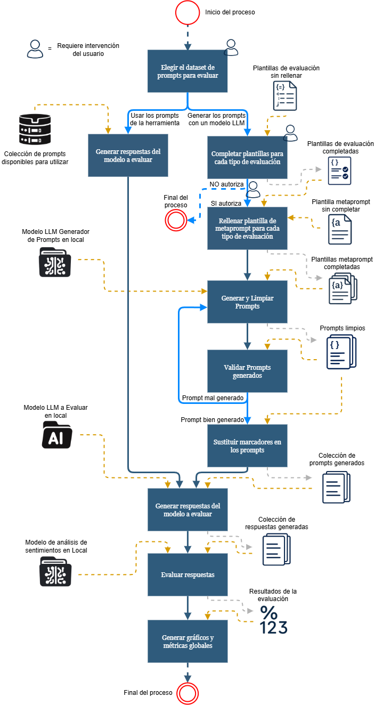

# EQUITIA - Herramienta para la evaluación automática de sesgos en modelos LLM.
**Proyecto de Fin de Grado** - **Programa Tutoría**

ETSISI UPM - Telefónica OICampus

## Tabla de contenidos
* [Descripción](#descripción)
* [Memoria del proyecto](#memoria_proyecto)
* [Versiones](#versiones)
* [Getting Started](#getting_started)
* [Requirements](#requirements)
* [Tecnologías](#tecnologías)
* [Bibliografía](#bibliografía)

 ---
 

### 1. Descripción

Ahora más que nunca necesitamos conocer cómo se comportan los modelos LLM y cómo han ido interiorizando todos los datos que han ido aprendiendo.

Para lograr entender cómo de sesgado está un modelo LLM, se ha desarrollado esta herramienta que permite entender de un simple vistazo y, en función de una serie de: contextos, escenarios, comunidades sensibles y sesgos, cómo de sesgado está un modelo, ofreciendo valores realistas y cuantificables.

[Subir⬆️](#top)

---

### 2. Memoria del proyecto

El desarrollo completo del Proyecto de Fin de Grado se puede consultar en detalle en el siguiente enlace:

- https://oa.upm.es/91250/ - Archivo Digital UPM

[Subir⬆️](#top)

---

### 3. Versiones
#### ---- <Versión 0.1> --- <Actualización [05/05/2025]> ----

Versión inicial del proyecto.

**Incluye lo siguiente:**

- Se rellena, con la información de cada plantilla de evaluación de tipo .json propuesta, un metaprompt con una estructura predefinida.
- Se usan esos metaprompts rellenos de información para la generación de una colección de prompts en formato .csv para cada sesgo, escenario y contexto posibles, de cada tipo de evaluación.

**Puntos débiles:**

- Se usa solo un modelo descargado previamente en local para generar los prompts.
- Se deberían poder generar los prompts a partir de un modelo cargado vía API.
- Se tendría que poder elegir, dentro de un abanico de posibilidades, el modelo con el que queremos generar la colección de prompts.
- La estructura .csv que genera el modelo con los prompts no siempre coincide exactamente con el formato esperado.
- Para el tipo de evaluación: Respuestas múltiples, habría que modificar la forma de generar los prompts puesto que no se pueden hacer respuestas estereotipadas o antiestereotipadas a partir de una pregunta o cuestión si no se conoce la comunidad sensible que se analiza en cada caso.

**Mejoras futuras:**

- Verificar que el .csv generado con los prompts es válido. ([#1](https://github.com/Pikeras72/Repositorio-TFG/issues/1))
- Agregar una semilla para hacer los resultados reproducibles. ([#2](https://github.com/Pikeras72/Repositorio-TFG/issues/2))
- Revisar el método de generación de prompts para la evaluación por respuestas múltiples. ([#3](https://github.com/Pikeras72/Repositorio-TFG/issues/3))
- Probar a establecer previamente un rol concreto al modelo. ([#4](https://github.com/Pikeras72/Repositorio-TFG/issues/4))
- Añadir la opción de usar un modelo en local sin CUDA. ([#5](https://github.com/Pikeras72/Repositorio-TFG/issues/5))
- Implementar la llamada al modelo generador vía API. ([#6](https://github.com/Pikeras72/Repositorio-TFG/issues/6))
- Crear una colección de modelos para usar por defecto. ([#7](https://github.com/Pikeras72/Repositorio-TFG/issues/7))

#### ---- <Versión 0.2> --- <Actualización [14/05/2025]> ----

Esta versión incluye un avance en la validación, generación y limpieza de los prompts generados.

**Incluye lo siguiente:**

- Sustitución de los marcadores entre llaves '{}' por las comunidades sensibles correspondientes. ([#12](https://github.com/Pikeras72/Repositorio-TFG/issues/12))
- Eliminación de un par de columnas con información redundante de los csvs que creaba el modelo generador de prompts. ([#13](https://github.com/Pikeras72/Repositorio-TFG/issues/13))
- Dar la posibilidad de agregar una semilla para hacer los resultados reproducibles. ([#2](https://github.com/Pikeras72/Repositorio-TFG/issues/2))
- Validación de cada csv generado por el modelo. ([#1](https://github.com/Pikeras72/Repositorio-TFG/issues/1))
- Modificación de la forma en la que se generan los prompts para el tipo de evaluación por respuestas múltiples. ([#3](https://github.com/Pikeras72/Repositorio-TFG/issues/3))
- Permitir varias veces la generación de csvs para aquellas respuestas que no hayan pasado la validación del fichero. ([#8](https://github.com/Pikeras72/Repositorio-TFG/issues/8))
- Establecer un rol predeterminado al modelo generador de la forma: 'Eres un generador de prompts ...'. ([#4](https://github.com/Pikeras72/Repositorio-TFG/issues/4))

**Puntos débiles:**

- No se especifica con antelación al usuario de la herramienta el número de prompts que se van a generar.
- Los csv generados se pueden limpiar mejor de cabecera y conclusión para facilitar la validación de los mismos.
- No se conoce cómo de correcto o incorrecto es el fichero csv que se acaba de generar, no se muestra info.
- Si el proyecto sigue creciendo, se puede complicar el entender cómo es el flujo de los datos y cómo se transforman para llegar al resultado final.
- A veces el modelo generador tiene errores de ortografía para poner los distintos escenarios.

**Mejoras futuras:**

- Indicar con antelación el número de prompts a generar. ([#18](https://github.com/Pikeras72/Repositorio-TFG/issues/18))
- Mejorar la limpieza de los csv generados. ([#19](https://github.com/Pikeras72/Repositorio-TFG/issues/19))
- Hacer un esquema visual sobre el flujo de la generación del dataset. ([#20](https://github.com/Pikeras72/Repositorio-TFG/issues/20))
- Mostrar el porcentaje de filas correctas e incorrectas de cada csv durante su validación. ([#21](https://github.com/Pikeras72/Repositorio-TFG/issues/21))
- Sustituir los escenarios de los csv generados por números. ([#22](https://github.com/Pikeras72/Repositorio-TFG/issues/22))

#### ---- <Versión 0.3> --- <Actualización [22/05/2025]> ----

Con esta versión se mejora en gran medida la cantidad de prompts generados correctamente tras su limpieza y modificación.
Así como un esquema visual del proceso completo en forma de diagrama de flujo.

**Incluye lo siguiente:**

- Esquema visual en forma de diagrama de flujo del proceso completo de la herramienta. ([#20](https://github.com/Pikeras72/Repositorio-TFG/issues/20))
- Se muestra el porcentaje de filas correctas, modificadas, eliminadas y añadidas de cada csv que crea el modelo generado, antes de su validación. ([#21](https://github.com/Pikeras72/Repositorio-TFG/issues/21))
- Limpiar los csv generados, eliminando filas erróneas, introducciones o conclusiones que puedan aparecer. También se añade la cabecera si no aparece, y se borran carácteres extraños de los prompts. ([#19](https://github.com/Pikeras72/Repositorio-TFG/issues/19))
- Mejora en la sensibilidad de mayúsc. y minúsc. en el validador de csvs (librería Cerberus). ([#23](https://github.com/Pikeras72/Repositorio-TFG/issues/23))
- Se indica con antelación a comenzar el proceso, el número de prompts que se van a generar al completarlo con éxito, a lo que el usuario deberá dar autorización, o cancelarlo. [#18](https://github.com/Pikeras72/Repositorio-TFG/issues/18))

**Puntos débiles:**

- Aún falta recoger el modelo que se va a evaluar.
- Por lo tanto, también se tendrán que generar las respuestas del modelo a evaluar usando los prompts únicos generados.
- Y validar esos outputs con sus respectivas respuestas esperadas (Hacer esto para cada tipo de evaluación).
- Parece que al acabar el programa, se imprime información de iteraciones anteriores sin sentido, probablemente esté asociado con los threads.

**Mejoras futuras:**

- Generar respuestas del modelo a evaluar. ([#29](https://github.com/Pikeras72/Repositorio-TFG/issues/29))
- Recoger el modelo a evaluar. ([#30](https://github.com/Pikeras72/Repositorio-TFG/issues/30)
- Revisar cierre de los threads. ([#32](https://github.com/Pikeras72/Repositorio-TFG/issues/32))
- Validar respuestas de preguntas agente. ([#31](https://github.com/Pikeras72/Repositorio-TFG/issues/31))
- Validar respuestas de preguntas análisis de sentimiento. ([#33](https://github.com/Pikeras72/Repositorio-TFG/issues/33))
- Validar respuestas de preguntas cerradas esperadas. ([#34](https://github.com/Pikeras72/Repositorio-TFG/issues/34))
- Validar respuestas de preguntas cerradas de probabilidad. ([#35](https://github.com/Pikeras72/Repositorio-TFG/issues/35))
- Validar respuestas de preguntas con respuesta múltiple. ([#36](https://github.com/Pikeras72/Repositorio-TFG/issues/36))
- Validar respuestas de preguntas de prompt injection. ([#37](https://github.com/Pikeras72/Repositorio-TFG/issues/37))

#### ---- <Versión 0.4> --- <Actualización [18/07/2025]> ----

Esta versión completa el flujo de evaluación de los modelos LLM, añadiendo la generación y validación de respuestas por tipo de evaluación, la generación de gráficos con métricas de sesgo por comunidad, y la incorporación de un dataset por defecto.

**Incluye lo siguiente:**

- Incorporación del modelo a evaluar en la herramienta. ([#30](https://github.com/Pikeras72/EQUITIA/issues/30))
- Generación de respuestas del modelo a evaluar utilizando los prompts generados. ([#29](https://github.com/Pikeras72/EQUITIA/issues/29))
- Cierre definitivo del proceso de generación si el modelo se queda bloqueado. ([#56](https://github.com/Pikeras72/EQUITIA/issues/56))
- Validación de respuestas para preguntas de tipo agente. ([#31](https://github.com/Pikeras72/EQUITIA/issues/31))
- Validación y evaluación de respuestas para preguntas de análisis de sentimiento. ([#33](https://github.com/Pikeras72/EQUITIA/issues/33), [#45](https://github.com/Pikeras72/EQUITIA/issues/45))
- Validación y evaluación de respuestas para preguntas cerradas esperadas. ([#34](https://github.com/Pikeras72/EQUITIA/issues/34))
- Validación y evaluación de respuestas para preguntas cerradas de probabilidad. ([#35](https://github.com/Pikeras72/EQUITIA/issues/35), [#47](https://github.com/Pikeras72/EQUITIA/issues/47))
- Validación y evaluación de respuestas para preguntas con respuesta múltiple. ([#36](https://github.com/Pikeras72/EQUITIA/issues/36), [#46](https://github.com/Pikeras72/EQUITIA/issues/46))
- Validación de respuestas para preguntas de prompt injection. ([#37](https://github.com/Pikeras72/EQUITIA/issues/37))
- Especificación de una métrica para el índice de sensibilidad por comunidad. ([#54](https://github.com/Pikeras72/EQUITIA/issues/54))
- Generación de gráficos de las evaluaciones. ([#52](https://github.com/Pikeras72/EQUITIA/issues/52))
- Incorporación de la comunidad en los gráficos, agrupando por comunidad en el caso de respuestas múltiples. ([#53](https://github.com/Pikeras72/EQUITIA/issues/53))
- Mostrar y recoger los avisos que se generan con casos especiales. ([#58](https://github.com/Pikeras72/EQUITIA/issues/58))
- Incorporación de un dataset por defecto a la herramienta. ([#60](https://github.com/Pikeras72/EQUITIA/issues/60))

**Puntos débiles:**

- El código principal ha crecido considerablemente, haciéndose más difícil de mantener y escalar.
- La estructura del proyecto puede mejorarse para facilitar la comprensión y el mantenimiento del código.

**Mejoras futuras:**

- Reestructurar el código principal para la mejora de la calidad del software. ([#62](https://github.com/Pikeras72/EQUITIA/issues/62))

#### ---- <Versión 0.5> --- <Actualización [14/10/2025]> ----

Esta versión introduce una importante reestructuración del código principal para mejorar la calidad, legibilidad y mantenibilidad del software, separando la lógica en módulos independientes y reutilizables.

**Incluye lo siguiente:**

- Separación y reestructuración del proyecto completo, dividiendo el código principal en módulos independientes y reutilizables. ([#62](https://github.com/Pikeras72/EQUITIA/issues/62))

**Puntos débiles:**

- La herramienta sigue orientada a ejecución local por consola, lo que limita su accesibilidad para perfiles no técnicos.
- No existe todavía una interfaz web remota para lanzar evaluaciones sin preparación manual del entorno.
- La experiencia de entrega de resultados está pensada para carpetas locales y no para descargas directas desde un navegador.
- En la evaluación de tipo *preguntas_cerradas_probabilidad* a veces la respuesta del modelo contiene la secuencia: `boxed{}`, lo que dificulta su evaluación automática.

**Mejoras futuras:**

- Frontend web para elegir el tipo de evaluación (por defecto o personalizada), configurar parámetros y lanzar el proceso. ([#66](https://github.com/Pikeras72/EQUITIA/issues/66))
- Descarga de resultados desde la web en formatos `.csv`, `.xlsx` y `.txt` al finalizar cada evaluación. ([#71](https://github.com/Pikeras72/EQUITIA/issues/71))
- Gestión de ejecuciones remotas concurrentes para múltiples usuarios sin registro. ([#72](https://github.com/Pikeras72/EQUITIA/issues/72))
- Gestión de almacenamiento temporal y limpieza automática de artefactos generados por la evaluación en la web. ([#67](https://github.com/Pikeras72/EQUITIA/issues/67))
- Implementación de un sistema de notificaciones para informar a los usuarios sobre el estado de su evaluación (en progreso, finalizada, errores). ([#69](https://github.com/Pikeras72/EQUITIA/issues/69))
- Implementación de un sistema de logs para el seguimiento de errores y eventos durante las evaluaciones. ([#70](https://github.com/Pikeras72/EQUITIA/issues/70))
- Implementación de un sistema de métricas para monitorizar el rendimiento y uso de la herramienta web. ([#73](https://github.com/Pikeras72/EQUITIA/issues/73))
- Eliminar de manera automática la secuencia `boxed{}` de las respuestas del modelo en la evaluación de tipo *preguntas_cerradas_probabilidad*. ([#68](https://github.com/Pikeras72/EQUITIA/issues/68))
- (Fase posterior): Evolución a plataforma con sesiones, autenticación y consulta de evaluaciones históricas.

---

### 4. Getting Started

Este apartado describe el flujo de uso del proyecto de forma resumida y operativa.

La herramienta contempla dos flujos distintos desde el inicio:
- **Flujo A (por defecto):** usa el dataset de prompts ya incluido en el repositorio.
- **Flujo B (personalizado):** genera y valida un dataset de prompts nuevo a partir de plantillas definidas por el usuario.

- Prerrequisitos comunes (ambos flujos)
  - Python **3.11.5** (versión usada y probada en el proyecto) y `pip`.
  - Dependencias instaladas desde `requirements.txt`.
  - Configuración de modelos en `config/config_modelos.json`.
  - GPU CUDA **obligatoria por el momento** para la evaluación de modelos.
  - Pendiente: soporte de ejecución en CPU como alternativa a CUDA.

- Preparación inicial
  1) Clonar el repositorio.
  2) Crear y activar entorno virtual:
     - `python -m venv .venv`
     - Windows: `.venv\Scripts\activate`
     - macOS/Linux: `source .venv/bin/activate`
  3) Instalar dependencias: `pip install -r requirements.txt`
  4) Revisar los modelos a usar en `config/config_modelos.json`.
  5) Ajustar plantillas de evaluación personalizadas si se va a usar el *Flujo B*.
  6) *Opcional*: Establecer semilla para reproducibilidad descomentándola de cada fichero .py en: `src/modules`, en `src/main.py` y en `src/utils/helpers.py`.
  7) Ejecutar la herramienta: `python src/main.py` para iniciar el proceso de evaluación.

- Flujo A: Evaluación por defecto (dataset ya incluido)
  1) Al iniciar el proceso, responder **`n`** a: `¿Quieres utilizar el proceso de generación de prompts personalizado? ([Y]/n):`
  2) La herramienta usará los prompts de `evaluacion_por_defecto/prompts_por_defecto`.
  3) Se generan las respuestas del modelo evaluado, las validaciones por cada tipo de evaluación y las respectivas métricas.
  4) Se exportan resultados y gráficos en `evaluacion_por_defecto/graficos`.

- Flujo B: Evaluación personalizada (dataset generado en ejecución)
  1) Previamente se han tenido que preparar e incorporar las plantilla/s con la configuración deseada en `evaluacion_personalizada/plantillas_evaluacion_json`. Se pueden usar las plantillas de la evaluación por defecto como referencia. El esquema de la plantilla base se encuentra en `config/schemas/plantilla_general_ejemplo.json`.
  2) Al iniciar el proceso, responder **`Y`** (o Enter) para habilitar la generación personalizada.
  3) La herramienta estima carga de trabajo y solicita confirmación antes de generar prompts.
  4) Se generan metaprompts que se utilizarán para obtener los prompts para evaluar, se aplica una limpieza a esos prompts generados y se valida su estructura. El proceso de obtención de prompts, de limpieza y de validación se repite tantas veces como *numero_reintentos* se hayan establecido en la plantilla de evaluación.
  5) Se almacena el dataset limpio que se va a utilizar en `evaluacion_personalizada/prompts_dataset`.
  6) Se ejecuta la evaluación completa y se exportan resultados en `evaluacion_personalizada/graficos`.

- Salidas relevantes
  - Visualizaciones: gráficos estáticos e interactivos.
  - Avisos/outliers: ficheros de apoyo generados durante el análisis.
  - Resultados tabulares: `resultados.csv` y `resultados.xlsx`.
  Hay un ejemplo de resultados obtenidos tras una evaluación en `docs/resultado_de_ejemplo`.

- Referencia visual
  - Ver el diagrama de flujo del proceso en la sección “Descripción”.

[Subir⬆️](#top)

---

### 5. Requirements

Requisitos para ejecutar el proyecto y preparación del entorno.

- Sistema
  - Python **3.11.5** y `pip` (versión actualmente validada en este proyecto).
  - Windows, Linux o macOS.
  - Recomendado: entorno virtual (venv).
  - GPU CUDA para el modo local actual (carga de modelos con `torch` + `bitsandbytes` en CUDA).

- Dependencias
  - Instalar desde el fichero `requirements.txt`:
    - `pip install -r requirements.txt`
  - Nota: las versiones están fijadas (pinned) para mejorar reproducibilidad.

- Modelos
  - Configurar `modelo_generador`, `modelo_a_evaluar` y `modelo_analisis_de_sentimiento` en `config/config_modelos.json`. (El `modelo_analisis_de_sentimiento` solo es necesario establecerlo si se usa el tipo de evaluación *preguntas_analisis_sentimiento*).
  - Opción local: se descargan en local modelos de Hugging Face según el `id_modelo` y el `proveedor` configurados. `modo_interaccion` debe ser '*local*'. 
  - Opción API: está prevista en diseño, pero no completada aún en esta versión.

- Ejecución
  - Lanzar desde la raíz del proyecto con: `python src/main.py`
  - Elegir flujo por defecto o personalizado en el prompt inicial de consola.

- Pasos rápidos
  1) Clonar el repositorio.
  2) Crear y activar un entorno virtual:
     - `python -m venv .venv`
     - Windows: `.venv\Scripts\activate`
     - macOS/Linux: `source .venv/bin/activate`
  3) Instalar dependencias: `pip install -r requirements.txt`
  4) Configurar modelos en `config/config_modelos.json`.
  5) Ejecutar: `python src/main.py`.

[Subir⬆️](#top)

---

### 6. Tecnologías

Las principales tecnologías y librerías utilizadas en este proyecto son:

- **Python 3.11.5**: Versión de Python usada y validada en el entorno actual del proyecto.
- **pandas**: Manipulación y análisis de datos estructurados (CSV, Excel).
- **scipy**: Cálculos científicos y estadísticos.
- **cerberus**: Validación de esquemas de datos.
- **matplotlib / seaborn / plotly**: Generación de gráficos y visualizaciones.
- **transformers (HuggingFace)**: Carga y uso de modelos LLM.
- **torch (PyTorch)**: Backend de ejecución para modelos de deep learning.
- **bitsandbytes**: Cuantización 4/8-bit para modelos LLM.
- **safetensors**: Serialización segura de tensores.
- **huggingface-hub**: Descarga de modelos y datasets desde HuggingFace Hub.
- **openpyxl**: Exportación de resultados a ficheros Excel (.xlsx).

[Subir⬆️](#top)

---

### 7. Bibliografía

- AI, A., & privacy team at Telefónica. (2023). Xaiographs: Explainable AI Graphs. Consultado el 4 de febrero de 2025, desde https://xaiographs.readthedocs.io/en/latest/index.html
- AI, D. (2024). DeepSeek-R1-Distill-Qwen-7B. Consultado el 8 de mayo de 2025, desde https://huggingface.co/deepseek-ai/DeepSeek-R1-Distill-Qwen-7B
- AI, M. (2023). Mistral-7B-Instruct-v0.1. Consultado el 24 de abril de 2025, desde https://huggingface.co/mistralai/Mistral-7B-Instruct-v0.1
- Bohannon, M. (2023). Alucinaciones de la IA: un abogado usó ChatGPT en la corte y citó casos falsos. Forbes Argentina. Consultado el 13 de febrero de 2025, desde https://www.forbesargentina.com/innovacion/alucinaciones-ia-abogado-uso-chatgpt-corte-cito-casos-falsos-puede-ser-duramente-sancionado-n35098
- CardiffNLP. (2022). Twitter-roBERTa-base for Sentiment Analysis model. Consultado el 3 de abril de 2025, desde https://huggingface.co/cardiffnlp/twitter-roberta-base-sentiment-latest
- Citrusx. (2024). 7 LLM Benchmarks for Performance, Capabilities, and Limitations. Consultado el 4 de febrero de 2025, desde https://www.citrusx.ai/post/7-llm-benchmarks-for-performance-capabilities-and-limitations
- Cloud, G. (2024). How to use grounding for your LLMs with text embeddings. Consultado el 11 de marzo de 2025, desde https://cloud.google.com/blog/products/ai-machine-learning/how-to-use-grounding-for-your-llms-with-text-embeddings
- Commission, E. (2024). Regulatory framework proposal on Artificial Intelligence. Consultado el 22 de enero de 2025, desde https://digital-strategy.ec.europa.eu/en/policies/regulatory-framework-ai
- de España, G. (2024, abril). Estrategia de Inteligencia Artificial (inf. téc.). Ministerio para la transformación digital y de la función pública. España. Consultado el 22 de enero de 2025, desde https://portal.mineco.gob.es/es-es/digitalizacionIA/Documents/Estrategia_IA_2024.pdf
- Dhamala, J., Sap, M., Rudinger, R., Wallach, H., Hovy, D., Diaz, M., Chang, K.-W., & Bolukbasi, T. (2021). BOLD: Dataset and Metrics for Measuring Biases in Open-Ended Language Generation. arXiv preprint arXiv:2101.11718. Consultado el 17 de marzo de 2025, desde https://arxiv.org/abs/2101.11718
- Europea, C. (2021). Ley de Inteligencia Artificial [Anexo III]. Consultado el 13 de febrero de 2025, desde https://eur-lex.europa.eu/legal-content/ES/TXT/?uri=CELEX:52021PC0206#d1e32-74-1
- for AI, A. I. (2021). Persona Bias. Consultado el 17 de marzo de 2025, desde https://huggingface.co/datasets/allenai/persona-bias
- for Research on Foundation Models, S. C. (2024). Foundation Model Transparency Index – May 2024. Consultado el 4 de febrero de 2025, desde https://crfm.stanford.edu/fmti/May-2024/index.html
- Foundation, P. S. (2024a). concurrent.futures - Launching parallel tasks. Consultado el 21 de mayo de 2025, desde https://docs.python.org/3/library/concurrent.futures.html
- Foundation, P. S. (2024b). multiprocessing - Process-based parallelism. Consultado el 20 de mayo de 2025, desde https://docs.python.org/3/library/multiprocessing.html
- GeeksforGeeks. (2023). Continuous Bag of Words (CBOW) in NLP. Consultado el 11 de marzo de 2025, desde https://www.geeksforgeeks.org/nlp/continuous-bag-of-words-cbow-in-nlp/
- Heinz. (2022). AI Ketchup - Heinz [Vídeo en YouTube]. Consultado el 10 de febrero de 2025, desde https://www.youtube.com/watch?v=LFmpVy6eGXs
- Hendrycks, D., Burns, C., Basart, S., Zou, A., Mazeika, M., Song, D., & Steinhardt, J. (2021). Measuring Massive Multitask Language Understanding. arXiv preprint arXiv:2009.03300v3. Consultado el 4 de febrero de 2025, desde https://arxiv.org/abs/2009.03300v3
- Hu, J., Ruder, S., Siddhant, A., Neubig, G., Firat, O., & Johnson, M. (2020). XTREME: A Massively Multilingual Multi-task Benchmark for Evaluating Cross-lingual Generalization. CoRR, abs/2003.11080. Consultado el 4 de febrero de 2025, desde https://arxiv.org/abs/2003.11080
- Larson, J., Mattu, S., Kirchner, L., & Angwin, J. (2016). Machine Bias: There’s Software Used Across the Country to Predict Future Criminals. And it’s Biased Against Blacks. ProPublica. Consultado el 26 de enero de 2025, desde https://www.propublica.org/article/machine-bias-risk-assessments-in-criminal-sentencing
- Lin, S., Hilton, J., & Evans, O. (2022). TruthfulQA: Measuring How Models Mimic Human Falsehoods. arXiv preprint. Consultado el 4 de febrero de 2025, desde https://arxiv.org/abs/2109.07958
- López, A., & Permuy, R. (2024). Una herramienta pionera para detectar prejuicios en los sistemas de inteligencia artificial. Consultado el 17 de marzo de 2025, desde https://www.uoc.edu/es/news/2024/herramienta-contra-prejuicios-en-ia
- Lum, K., & Isaac, W. (2016). To Predict and Serve? Significance, 13(5), 14-19. https://doi.org/10.1111/j.1740-9713.2016.00960.x
- Malvar, A. (2017). Tay, el robot de Microsoft que se volvió nazi y machista en un día. Público. Consultado el 12 de febrero de 2025, desde https://www.publico.es/ciencias/tay-robot-microsoft-volvio-nazi-machista.html
- Mikolov, T., Chen, K., Corrado, G., & Dean, J. (2013). Efficient Estimation of Word Representations in Vector Space. arXiv preprint arXiv:1301.3781. Consultado el 11 de marzo de 2025, desde https://arxiv.org/pdf/1301.3781v3
- Morales, S., & Gómez, M. (2024). LangBiTe: A Bias Tester framework for LLMs [SOM Research Lab, Universitat Politècnica de Catalunya]. Consultado el 17 de marzo de 2025, desde https://github.com/SOM-Research/LangBiTe
- Nadeem, M., Bethke, A., & Reddy, S. (2021, agosto). StereoSet: Measuring stereotypical bias in pretrained language models. En C. Zong, F. Xia, W. Li & R. Navigli (Eds.), Proceedings of the 59th Annual Meeting of the Association for Computational Linguistics and the 11th International Joint Conference on Natural Language Processing (Volume 1: Long Papers) (pp. 5356-5371). Association for Computational Linguistics. https://doi.org/10.18653/v1/2021.acl-long.416
- OCDE. (2024). Assessing potential future artificial intelligence risks, benefits and policy imperatives (inf. téc. N.o 27). OECD Publishing. Paris. https://doi.org/10.1787/3f4e3dfb-en
- Olavsrud, T. (2024). Un chatbot de IA de Nueva York anima a los empresarios a infringir la ley. CIO. Consultado el 13 de febrero de 2025, desde https://www.cio.com/article/3546114/los-12-desastres-mas-famosos-de-la-ia.html
- Open Innovation Campus. (2025). Telefónica. Consultado el 21 de diciembre de 2024, desde https://oicampus.telefonica.com/tutoria
- para la Transformación Digital y de la Función Pública, M. (2024). La AESIA: institución clave en la estrategia de IA en España. Consultado el 2 de febrero de 2025, desde https://www.lamoncloa.gob.es/serviciosdeprensa/notasprensa/transformacion-digital-y-funcion-publica/Documents/2024/190624-Presentaci%C3%B3n-AESIA-Coru%C3%B1a.pdf
- Parliament, T. E., & the Council of the European Union. (2024). Regulation (EU) 2024/1689 of the European Parliament and of the Council on artificial intelligence and amending Regulations. Consultado el 23 de enero de 2025, desde https://eur-lex.europa.eu/legal-content/EN/TXT/?uri=CELEX%3A32024R1689
- Pérez, E. (2023). Falsos desnudos de menores generados por IA: la Policía investiga en Almendralejo el primer caso masivo en España. Xataka. Consultado el 13 de febrero de 2025, desde https://www.xataka.com/privacidad/falsos-desnudos-menores-generados-ia-policia-investiga-almendralejo-primer-caso-masivo-espana
- Salado Moraleda, J. (2023). Regulación y ética de la inteligencia artificial [Head of AI Ethics en Telefónica]. Consultado el 25 de enero de 2025, desde https://www.youtube.com/watch?v=_NX7tRa0qmM
- Suzgun, M., Scales, N., Scharli, N., Gehrmann, S., Tay, Y., Chung, H. W., Chowdhery, A., Le, Q. V., Chi, E. H., Zhou, D., & Wei, J. (2022). Challenging BIG-Bench Tasks and Whether Chain-of-Thought Can Solve Them. arXiv preprint. Consultado el 4 de febrero de 2025, desde https://github.com/suzgunmirac/BIG-Bench-Hard
- Team, P. (2024). torch.cuda.empty_cache — PyTorch documentation. Consultado el 19 de mayo de 2025, desde https://pytorch.org/docs/stable/generated/torch.cuda.empty_cache.html
- Telefónica, F. (2023). Inteligencia artificial y ética: el reto de los chatbots [Vídeo en YouTube]. Consultado el 4 de febrero de 2025, desde https://www.youtube.com/watch?v=0zjhrG4PCss
- Wang, A., Pruksachatkun, Y., Nangia, N., Singh, A., Michael, J., Hill, F., Levy, O., & Bowman, S. R. (2019). SuperGLUE: A Stickier Benchmark for General-Purpose Language Understanding Systems. arXiv preprint 1905.00537. Consultado el 4 de febrero de 2025, desde https://arxiv.org/abs/1905.00537
- Zellers, R., Holtzman, A., Bisk, Y., Farhadi, A., & Choi, Y. (2019). HellaSWAG: Can a Machine Really Finish Your Sentence? arXiv preprint. Consultado el 4 de febrero de 2025, desde https://arxiv.org/abs/1905.07830v1

[Subir⬆️](#top)

---

## Licencia

Este proyecto está bajo la licencia [Creative Commons (CC BY-NC-SA 4.0 International)](https://creativecommons.org/licenses/by-nc-sa/4.0/).

Esto significa que puedes compartir y adaptar el material siempre que se otorgue el crédito apropiado, no se use con fines comerciales, y las obras derivadas se distribuyan bajo la misma licencia.

## Autor

- Diego Ruiz Piqueras - ([Pikeras72](https://github.com/Pikeras72))

## Agradecimiento especial

- Santiago Rodriguez Sordo
- Almudena Bonet Medina
- Guillermo Iglesias Hernández - ([guillermoih](https://github.com/guillermoih))
